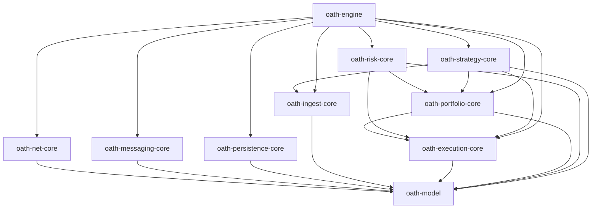

> ⚠️ **Work in progress — do not use.**

# OATH — Open Automatic Trading Hub

A modular, backend-agnostic trading engine for Rust.

Every subsystem is defined behind a trait. Backends, adapters, transports, and strategies are all independently swappable. Users implement `Strategy`; everything else is configurable and replaceable.

## Domain Layout

| Crate | Purpose |
|---|---|
| `oath-model` | Shared domain primitives: `Symbol`, `Price`, `Quantity`, `Timestamp`, `Side` |
| `oath-net-core` | HTTP and WebSocket client traits |
| `oath-messaging-core` | Message bus, event publishing and subscribing |
| `oath-persistence-core` | Repository and event log traits |
| `oath-ingest-core` | Market data feed: quotes, trades, bars |
| `oath-execution-core` | Order lifecycle, fills, execution reports |
| `oath-portfolio-core` | Positions, P&L, account management |
| `oath-risk-core` | Risk checks, risk engine, verdicts |
| `oath-strategy-core` | User-facing `Strategy` trait and signals |
| `oath-engine` | Composes all layers via `EngineBuilder` |

## Dependency Graph



Backend crates (e.g. `oath-net-reqwest`, `oath-messaging-memory`, `oath-persistence-sqlite`) and adapter crates (e.g. `oath-adapter-ibkr`) are coming soon.

## Setup

After cloning, activate the local git hooks:

```sh
git config core.hooksPath .githooks
```

This is done automatically inside the dev container.

## License

MIT OR Apache-2.0
