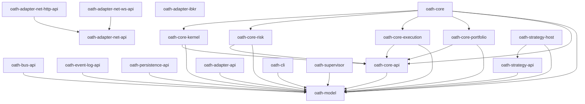

> ⚠️ **Work in progress — do not use.**

# OATH — Open Automatic Trading Hub

[](https://github.com/NotAProfDev/oath/actions/workflows/ci.yml)
[](https://github.com/NotAProfDev/oath/actions/workflows/codeql.yml)

A modular, backend-agnostic trading engine for Rust.

Every subsystem is defined behind a trait. Backends, adapters, transports, and strategies are all independently swappable. Users implement `Strategy`; everything else is configurable and replaceable.

## Domain Layout

| Crate | Purpose |
|---|---|
| `oath-model` | Canonical domain primitives and message payloads — the root contract |
| `oath-bus-api` | Bus trait: backend-agnostic transport (LatestValue / Reliable classes) |
| `oath-event-log-api` | Event Log + Snapshot traits: the ordered recovery spine |
| `oath-persistence-api` | Repository trait: keyed, queryable read-models and dedup tables |
| `oath-core-api` | Core trait hub: `StateView`, `Decision`, `ActionSink`, the Policy contracts |
| `oath-core-risk` / `-execution` / `-portfolio` | Policy implementations bound by the Core binary |
| `oath-core-kernel` | The `Kernel<R, E, P>` single-writer loop |
| `oath-core` | The Core process binary |
| `oath-adapter-api` | Harness + `Broker` / `DataProvider` traits for venue adapters |
| `oath-adapter-net-api` | Transport-neutral composition primitives (`Layer`, `LayerBuilder`, `Stack`) + `ErrorKind` / `Timer` |
| `oath-adapter-net-http-api` | HTTP transport contract (`Service`, …) over the `oath-adapter-net-api` kernel |
| `oath-adapter-net-ws-api` | WebSocket transport contract (`Frame`, `WsSink`/`WsSource`, `Lifecycle`, `WsConnector`, …) over the `oath-adapter-net-api` kernel |
| `oath-adapter-ibkr` | IBKR venue adapter — Client Portal API v1 (`cpapi`) read + order-write wire layer; `webapi` (beta OAuth) / `tws` (socket) surfaces to follow |
| `oath-strategy-api` | User-facing `Strategy` trait and Signal ergonomics (the canonical `Signal` payload lives in `oath-model`, per ADR-0028) |
| `oath-strategy-host` | Strategy Node binary: hosts user strategies, isolated from Core |
| `oath-cli` | The first Frontend (MVP) |
| `oath-supervisor` | Operational-plane process: boots and watches the topology |

## Dependency Graph



The crates above are compiling skeletons. Bus/Event-Log/persistence backends (e.g. `oath-bus-iceoryx2`, `oath-event-log-chronicle`, `oath-persistence-sqlite`) are coming soon. The first venue adapter, `oath-adapter-ibkr`, covers the Client Portal API v1 read and order-write wire layers.

## Setup

After cloning, activate the local git hooks:

```sh
git config core.hooksPath .githooks
```

This is done automatically inside the dev container.

### Dev container

The dev container provisions all tooling (`gh`, `just`, `gitleaks`,
`shellcheck`, `actionlint`, `typos`, `taplo`, and the `cargo-*` tools) via
[`.devcontainer/post-create.sh`](.devcontainer/post-create.sh).

The GitHub CLI authenticates by forwarding your host credentials. If you are
already signed in with `gh` on your machine, `gh` works inside the container
with no extra steps. Otherwise, run `gh auth login` once inside the container.

## License

MIT OR Apache-2.0
