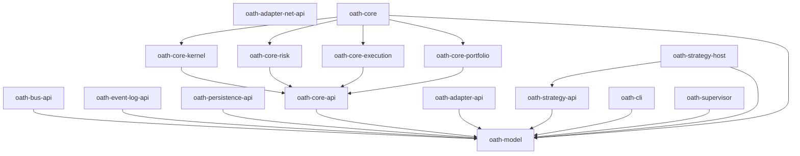

# Crate Topology Restructure (ADR-0009) Implementation Plan

> **For agentic workers:** REQUIRED SUB-SKILL: Use superpowers:subagent-driven-development (recommended) or superpowers:executing-plans to implement this plan task-by-task. Steps use checkbox (`- [ ]`) syntax for tracking.

**Goal:** Restructure the Cargo workspace so its crate layout matches the process-aligned, spine-inverted topology defined in [ADR-0009](../../adr/0009-crate-topology-spine-inverted-process-aligned.md).

**Architecture:** Today's workspace is the monolith graph `oath-engine → {everything}` with inter-layer trait edges (`risk → execution → portfolio`). ADRs 0001–0008 commit to a single-host, multi-process, event-sourced system, which inverts the graph: there is no top composer, only a bottom contract (`oath-model`) every process depends on. This plan renames/moves/splits/deletes crates so the dependency arrows point inward to `oath-model` and the directory layout encodes process boundaries (`<subsystem>/api` = traits; `core/` = the Core process).

**Tech Stack:** Rust (edition 2024), Cargo workspaces, `just` task runner, `cargo-machete`, `cargo-deny`, `taplo`, `nextest`.

## Scope

**In scope — structural only.** Every existing crate except `oath-net-core` is an empty 2-line skeleton (a `//!` doc comment + `#![forbid(unsafe_code)]`). This plan moves that skeleton to the new topology and creates compiling skeletons for the new process crates. The deliverable is: **the workspace matches ADR-0009's target layout and `just ci` is green.**

**Out of scope — follow-on issues, one per ADR.** Designing trait bodies (`Bus`, `StateView`, `Decision`, `RiskPolicy`/`ExecutionPolicy`/`Portfolio`, `Broker`/`DataProvider`, `Strategy`), the `Kernel<R,E,P>` loop, the Event-Log/Snapshot traits, and any backend or adapter implementation. The new `*-api`, `*-kernel`, host, `cli`, and `supervisor` crates are created as **empty compiling skeletons** with a doc comment describing their role; their contents are later work. Do **not** invent trait signatures in this plan.

**Why skeleton-only is the right scope:** ADR-0009 is a *topology* decision; the trait designs live in other ADRs (0005, 0008, 0020–0022) and are separate `one issue, one PR` units. The project status is "core trait crates defined, backends not yet built." Getting the topology in place first gives every follow-on ADR a home to be implemented into.

## Global Constraints

Copied verbatim from the workspace lint config and `CLAUDE.md`. Every task implicitly includes these.

- **Edition 2024, MSRV 1.90.** Crates inherit `edition.workspace = true` / `rust-version.workspace = true`. Validate MSRV with `just msrv`.
- **No `unsafe`** — `unsafe_code = "deny"` workspace-wide; every crate root also carries `#![forbid(unsafe_code)]`.
- **No `unwrap` / `expect` / indexing** in non-test code (warned). Not relevant to skeletons (no logic), but keep `main()` bodies empty rather than panicking.
- **Document public items** — `missing_docs` is warned and `just lint` runs `clippy … -- -D warnings`, so any **warning is a hard error**. Skeleton libs therefore expose **no `pub` items** (only a crate-level `//!` doc), and bins are a `//!` doc + `fn main() {}`.
- **`clippy::all` is deny-level.** Run `just lint` before every commit.
- **Every dependency declared ahead of first use must be in `[package.metadata.cargo-machete] ignored`** — `just ci` runs `cargo machete`. This is the established repo pattern; follow it exactly.
- **Respect dependency direction** — `oath-model` is the root; never introduce a cycle or an edge that contradicts ADR-0009.
- **Conventional Commits**, enforced by the `commit-msg` hook (subject ≤ 72 chars). Each task gives an exact message.
- **Definition of done is `just ci` green** — identical to the GitHub Actions gate. Do not bypass the git hooks.

---

## Before you begin

This is **one issue, one PR** (`CLAUDE.md` workflow). The plan document itself may already be committed on the current docs branch; the *restructure* happens on its own branch off `main`.

1. **Open the issue** (use the feature-request template): "Implement ADR-0009 crate topology (spine-inverted, process-aligned)". Note it in the PR with `Closes #N`.
2. **Branch off `main`:**
   ```bash
   git switch main && git pull
   git switch -c refactor/crate-topology-adr-0009
   ```
   (Optionally isolate via `superpowers:using-git-worktrees`.)
3. **Confirm a green baseline** before touching anything:
   ```bash
   just ci
   ```
   Expected: all gates pass (`fmt`, `fmt-toml`, `typos`, `lint`, `check`, `test`, `deny`, `doc`, `machete`, `gitleaks`, `actionlint`, `shellcheck`). If it is not green on a fresh `main`, stop and fix that first — the plan assumes a green start.

### Conventions every task follows

- **Atomic & green.** Each task leaves the workspace compiling and `just ci`-green, then commits. Never split a rename across commits — the manifest, the directory, the members list, the `[workspace.dependencies]` entry, and every dependent must change together.
- **Preserve history.** Use `git mv` for moves, `git rm` for deletes.
- **Refresh the lockfile.** A member-list or package-name change makes `Cargo.lock` stale, and `just check` passes `--locked` (it will *fail* on a stale lock). So after editing manifests run, in order:
  ```bash
  cargo check --workspace --all-targets --all-features   # recompiles + rewrites Cargo.lock
  cargo fmt --all                                         # normalize Rust
  taplo fmt                                               # normalize TOML (just ci runs `taplo fmt --check`)
  ```
  then `just ci`. Commit the updated `Cargo.lock` alongside the change.
- **Verification gate.** This is a structural refactor with no behaviour to unit-test, so each task's "test" is **`just ci` green** plus a structural assertion (the package set / a `cargo tree` edge). That is the honest gate here.
- **The skeleton templates** (used verbatim by the "create" tasks):

  *Library crate `Cargo.toml`* (`oath-model`-only dependants):
  ```toml
  [package]
  name = "oath-CRATE"
  version.workspace = true
  edition.workspace = true
  rust-version.workspace = true
  license.workspace = true

  [lints]
  workspace = true

  [dependencies]
  oath-model = { workspace = true }
  thiserror = { workspace = true }

  # cargo-machete: deps declared ahead of first use; prune from `ignored` as they are adopted.
  [package.metadata.cargo-machete]
  ignored = ["oath-model", "thiserror"]
  ```

  *Library crate `src/lib.rs`:*
  ```rust
  //! ONE-LINE ROLE FROM ADR-0009.
  #![forbid(unsafe_code)]
  ```

  *Binary crate `src/main.rs`:*
  ```rust
  //! ONE-LINE ROLE FROM ADR-0009.
  #![forbid(unsafe_code)]

  fn main() {}
  ```

---

## File Structure

### Current → target map

| Current crate (dir) | Action | Target crate (dir) |
|---|---|---|
| `oath-model` (`model/`) | keep | `oath-model` (`model/`) |
| `oath-engine` (`engine/`) | **delete** | — |
| `oath-ingest-core` (`ingest/core/`) | **delete** | — (market data becomes canonical messages in `oath-model`) |
| `oath-strategy-core` (`strategy/core/`) | rename + slim deps to `model` | `oath-strategy-api` (`strategy/api/`) |
| `oath-execution-core` (`execution/core/`) | move + repoint to `core/api` | `oath-core-execution` (`core/execution/`) |
| `oath-portfolio-core` (`portfolio/core/`) | move + repoint to `core/api` | `oath-core-portfolio` (`core/portfolio/`) |
| `oath-risk-core` (`risk/core/`) | move + repoint to `core/api` | `oath-core-risk` (`core/risk/`) |
| `oath-messaging-core` (`messaging/core/`) | **split** | `oath-bus-api` (`bus/api/`) + `oath-event-log-api` (`event-log/api/`) |
| `oath-persistence-core` (`persistence/core/`) | rename | `oath-persistence-api` (`persistence/api/`) |
| `oath-net-core` (`net/core/`) | move (real code + doctests) | `oath-adapter-net-api` (`adapter/net/api/`) |
| — | **create** | `oath-core-api` (`core/api/`) |
| — | **create** | `oath-core-kernel` (`core/kernel/`) |
| — | **create (bin)** | `oath-core` (`core/host/`) |
| — | **create** | `oath-adapter-api` (`adapter/api/`) |
| — | **create (bin)** | `oath-strategy-host` (`strategy/host/`) |
| — | **create (bin)** | `oath-cli` (`cli/`) |
| — | **create (bin)** | `oath-supervisor` (`supervisor/`) |

Result: **16 crates** (12 lib + 4 bin), up from 10.

### Target dependency edges (skeleton — minimal & defensible)

Each declared dependency is `{ workspace = true }` and listed in that crate's `cargo-machete` `ignored` (no code uses it yet).

| Crate | Internal deps |
|---|---|
| `oath-model` | — (root) |
| `oath-bus-api` | `oath-model` |
| `oath-event-log-api` | `oath-model` |
| `oath-persistence-api` | `oath-model` |
| `oath-core-api` | `oath-model` |
| `oath-core-risk` | `oath-core-api`, `oath-model` |
| `oath-core-execution` | `oath-core-api`, `oath-model` |
| `oath-core-portfolio` | `oath-core-api`, `oath-model` |
| `oath-core-kernel` | `oath-core-api`, `oath-model` |
| `oath-core` (bin) | `oath-core-kernel`, `oath-core-api`, `oath-core-risk`, `oath-core-execution`, `oath-core-portfolio`, `oath-model` |
| `oath-adapter-api` | `oath-model` |
| `oath-adapter-net-api` | — (external only: `bytes`, `http`, `http-body`, `futures-core`, `futures-sink`) |
| `oath-strategy-api` | `oath-model` |
| `oath-strategy-host` (bin) | `oath-strategy-api`, `oath-model` |
| `oath-cli` (bin) | `oath-model` |
| `oath-supervisor` (bin) | `oath-model` |

**Dependency rules used to pick the above:**
- New crates depend on the minimum that expresses their ADR-0009 role; when in doubt, `oath-model` only.
- The three relocated Policies (`core-risk`/`-execution`/`-portfolio`) drop their old inter-layer edges and depend on the trait hub `oath-core-api` — this *is* the spine inversion.
- The `oath-core` binary is the one place the composition is visible: it binds the Kernel + concrete Policies (ADR-0007/0008). Bus / Event-Log / persistence *backends* are wired here when they exist (follow-on); the binary depends on those `*-api` traits only once it uses them.
- Only **library** crates go in `[workspace.dependencies]`; the four binaries (`oath-core`, `oath-strategy-host`, `oath-cli`, `oath-supervisor`) do not (nothing depends on them).

### Target final state of root `Cargo.toml` (for reference — built up task by task)

`members`:
```toml
members = [
  "crates/model",
  "crates/bus/api",
  "crates/event-log/api",
  "crates/persistence/api",
  "crates/core/api",
  "crates/core/risk",
  "crates/core/execution",
  "crates/core/portfolio",
  "crates/core/kernel",
  "crates/core/host",
  "crates/adapter/api",
  "crates/adapter/net/api",
  "crates/strategy/api",
  "crates/strategy/host",
  "crates/cli",
  "crates/supervisor",
]
```

Internal `[workspace.dependencies]` (only the OATH path-deps shown; external deps unchanged):
```toml
oath-model = { path = "crates/model", version = "0.1.0" }
oath-bus-api = { path = "crates/bus/api", version = "0.1.0" }
oath-event-log-api = { path = "crates/event-log/api", version = "0.1.0" }
oath-persistence-api = { path = "crates/persistence/api", version = "0.1.0" }
oath-core-api = { path = "crates/core/api", version = "0.1.0" }
oath-core-risk = { path = "crates/core/risk", version = "0.1.0" }
oath-core-execution = { path = "crates/core/execution", version = "0.1.0" }
oath-core-portfolio = { path = "crates/core/portfolio", version = "0.1.0" }
oath-core-kernel = { path = "crates/core/kernel", version = "0.1.0" }
oath-adapter-api = { path = "crates/adapter/api", version = "0.1.0" }
oath-adapter-net-api = { path = "crates/adapter/net/api", version = "0.1.0" }
oath-strategy-api = { path = "crates/strategy/api", version = "0.1.0" }
```

---

## Task 1: Delete `oath-engine`

The monolith composer. Nothing depends on it (it is the top of the old graph), so it deletes cleanly and shrinks the graph first.

**Files:**
- Delete: `crates/engine/` (whole directory)
- Modify: `Cargo.toml` (root) — `members`

**Interfaces:**
- Consumes: nothing.
- Produces: a workspace with no `oath-engine` member. Later tasks rely on `oath-engine` being absent (it is not in `[workspace.dependencies]`, so only `members` changes).

- [ ] **Step 1: Remove the crate**

```bash
git rm -r crates/engine
```

- [ ] **Step 2: Remove it from the workspace members**

In `Cargo.toml` (root), delete this line from `members`:
```toml
  "crates/engine",
```

- [ ] **Step 3: Refresh lock + formatting**

```bash
cargo check --workspace --all-targets --all-features
cargo fmt --all
taplo fmt
```
Expected: `cargo check` succeeds; `Cargo.lock` no longer contains `name = "oath-engine"`.

- [ ] **Step 4: Verify the full gate**

```bash
just ci
```
Expected: all gates pass.

- [ ] **Step 5: Commit**

```bash
git add -A
git commit -m "refactor(engine): delete oath-engine composer (ADR-0009)"
```

---

## Task 2: Rename `strategy/core` → `strategy/api`, slim deps to `oath-model`

In the new topology `strategy/api` is the user-facing `Strategy` trait. It speaks only the canonical model (it consumes market data and proposes Signals over the Bus), so its old edges to `ingest`/`execution`/`portfolio` are dropped. Doing this *before* deleting `ingest` and moving the Policies removes `strategy` as a consumer of all three, decoupling the later tasks.

**Files:**
- Move: `crates/strategy/core/` → `crates/strategy/api/`
- Modify: `crates/strategy/api/Cargo.toml` (name + deps)
- Modify: `Cargo.toml` (root) — `members` + `[workspace.dependencies]`

**Interfaces:**
- Consumes: a graph with no `oath-engine`.
- Produces: `oath-strategy-api` at `crates/strategy/api`, depending only on `oath-model`. `oath-ingest-core`, `oath-execution-core`, `oath-portfolio-core` now have one fewer consumer each.

- [ ] **Step 1: Move the directory**

```bash
mkdir -p crates/strategy
git mv crates/strategy/core crates/strategy/api
```

- [ ] **Step 2: Rewrite `crates/strategy/api/Cargo.toml`**

Replace the whole file with:
```toml
[package]
name = "oath-strategy-api"
version.workspace = true
edition.workspace = true
rust-version.workspace = true
license.workspace = true

[lints]
workspace = true

[dependencies]
oath-model = { workspace = true }
thiserror = { workspace = true }

# cargo-machete: deps declared ahead of first use; prune from `ignored` as they are adopted.
[package.metadata.cargo-machete]
ignored = ["oath-model", "thiserror"]
```

- [ ] **Step 3: Update the crate doc comment**

In `crates/strategy/api/src/lib.rs`, the first line currently reads
`//! User-facing `Strategy` trait and signal types.` — keep it; it is still accurate. No change needed.

- [ ] **Step 4: Update the root `Cargo.toml`**

In `members`, change:
```toml
  "crates/strategy/core",
```
to:
```toml
  "crates/strategy/api",
```

In `[workspace.dependencies]`, change:
```toml
oath-strategy-core = { path = "crates/strategy/core", version = "0.1.0" }
```
to:
```toml
oath-strategy-api = { path = "crates/strategy/api", version = "0.1.0" }
```

- [ ] **Step 5: Refresh lock + formatting**

```bash
cargo check --workspace --all-targets --all-features
cargo fmt --all
taplo fmt
```
Expected: success; `Cargo.lock` shows `oath-strategy-api` and no `oath-strategy-core`.

- [ ] **Step 6: Verify**

```bash
just ci
```
Expected: all gates pass.

- [ ] **Step 7: Commit**

```bash
git add -A
git commit -m "refactor(strategy): rename core->api, depend only on model (ADR-0009)"
```

---

## Task 3: Delete `oath-ingest-core`

Per ADR-0009, market data is canonical messages in `oath-model`, published by adapters and carried on the Bus — there is no ingest trait crate. After Task 2 nothing depends on it.

**Files:**
- Delete: `crates/ingest/`
- Modify: `Cargo.toml` (root) — `members` + `[workspace.dependencies]`

**Interfaces:**
- Consumes: a graph where `strategy/api` no longer depends on ingest.
- Produces: no `oath-ingest-core` anywhere.

- [ ] **Step 1: Confirm there are no remaining consumers**

```bash
grep -rn "oath-ingest-core\|oath_ingest_core" crates/ Cargo.toml
```
Expected: only matches inside `crates/ingest/` itself and the root `Cargo.toml` (its member + workspace-dep lines). If anything else matches, stop — a consumer was missed.

- [ ] **Step 2: Remove the crate**

```bash
git rm -r crates/ingest
```

- [ ] **Step 3: Update the root `Cargo.toml`**

In `members`, delete:
```toml
  "crates/ingest/core",
```
In `[workspace.dependencies]`, delete:
```toml
oath-ingest-core = { path = "crates/ingest/core", version = "0.1.0" }
```

- [ ] **Step 4: Refresh lock + formatting**

```bash
cargo check --workspace --all-targets --all-features
cargo fmt --all
taplo fmt
```
Expected: success; `Cargo.lock` no longer contains `oath-ingest-core`.

- [ ] **Step 5: Verify**

```bash
just ci
```
Expected: all gates pass.

- [ ] **Step 6: Commit**

```bash
git add -A
git commit -m "refactor(ingest): delete oath-ingest-core; data is canonical model (ADR-0009)"
```

---

## Task 4: Create `oath-core-api` (the Core trait hub)

The trait hub the Kernel and Policies depend on (`StateView`, `Decision`, `ActionSink`, `RiskPolicy`/`ExecutionPolicy`/`Portfolio` — defined later). Must exist before Task 5 repoints the Policies onto it.

**Files:**
- Create: `crates/core/api/Cargo.toml`
- Create: `crates/core/api/src/lib.rs`
- Modify: `Cargo.toml` (root) — `members` + `[workspace.dependencies]`

**Interfaces:**
- Consumes: `oath-model`.
- Produces: `oath-core-api` at `crates/core/api` (workspace-dep key `oath-core-api`). Tasks 5 and 6 depend on it.

- [ ] **Step 1: Create `crates/core/api/Cargo.toml`**

```toml
[package]
name = "oath-core-api"
version.workspace = true
edition.workspace = true
rust-version.workspace = true
license.workspace = true

[lints]
workspace = true

[dependencies]
oath-model = { workspace = true }
thiserror = { workspace = true }

# cargo-machete: deps declared ahead of first use; prune from `ignored` as they are adopted.
[package.metadata.cargo-machete]
ignored = ["oath-model", "thiserror"]
```

- [ ] **Step 2: Create `crates/core/api/src/lib.rs`**

```rust
//! Core trait hub: `StateView`, `Decision`, `ActionSink`, and the
//! `RiskPolicy` / `ExecutionPolicy` / `Portfolio` Policy contracts.
#![forbid(unsafe_code)]
```

- [ ] **Step 3: Register in the root `Cargo.toml`**

Add to `members` (after `"crates/persistence/core",` is fine — order is cosmetic):
```toml
  "crates/core/api",
```
Add to `[workspace.dependencies]`:
```toml
oath-core-api = { path = "crates/core/api", version = "0.1.0" }
```

- [ ] **Step 4: Refresh lock + formatting**

```bash
cargo check --workspace --all-targets --all-features
cargo fmt --all
taplo fmt
```
Expected: success; `cargo check` reports `oath-core-api` compiled.

- [ ] **Step 5: Verify**

```bash
just ci
```
Expected: all gates pass.

- [ ] **Step 6: Commit**

```bash
git add -A
git commit -m "feat(core): add oath-core-api trait hub skeleton (ADR-0009)"
```

---

## Task 5: Move the Policies under `core/` and invert their edges onto `oath-core-api`

`execution/core` → `core/execution`, `portfolio/core` → `core/portfolio`, `risk/core` → `core/risk`. These three are entangled in the old graph (`risk → execution, portfolio`; `portfolio → execution`), and ADR-0009 inverts all of those edges to point at the trait hub. They therefore move in **one atomic task** — a reviewer evaluates the relocation as a unit, and no intermediate single-move compiles.

**Files:**
- Move: `crates/execution/core/` → `crates/core/execution/`
- Move: `crates/portfolio/core/` → `crates/core/portfolio/`
- Move: `crates/risk/core/` → `crates/core/risk/`
- Modify: each moved crate's `Cargo.toml` (name + deps)
- Modify: `Cargo.toml` (root) — `members` + `[workspace.dependencies]`

**Interfaces:**
- Consumes: `oath-core-api` (Task 4), `oath-model`.
- Produces: `oath-core-execution`, `oath-core-portfolio`, `oath-core-risk` at `crates/core/{execution,portfolio,risk}`, each depending on `oath-core-api` + `oath-model` only. Task 6 (`oath-core` host) binds all three.

- [ ] **Step 1: Move the three directories**

```bash
mkdir -p crates/core
git mv crates/execution/core crates/core/execution
git mv crates/portfolio/core crates/core/portfolio
git mv crates/risk/core      crates/core/risk
rmdir crates/execution crates/portfolio crates/risk 2>/dev/null || true
```

- [ ] **Step 2: Rewrite `crates/core/execution/Cargo.toml`**

```toml
[package]
name = "oath-core-execution"
version.workspace = true
edition.workspace = true
rust-version.workspace = true
license.workspace = true

[lints]
workspace = true

[dependencies]
oath-core-api = { workspace = true }
oath-model = { workspace = true }
thiserror = { workspace = true }

# cargo-machete: deps declared ahead of first use; prune from `ignored` as they are adopted.
[package.metadata.cargo-machete]
ignored = ["oath-core-api", "oath-model", "thiserror"]
```

- [ ] **Step 3: Rewrite `crates/core/portfolio/Cargo.toml`**

```toml
[package]
name = "oath-core-portfolio"
version.workspace = true
edition.workspace = true
rust-version.workspace = true
license.workspace = true

[lints]
workspace = true

[dependencies]
oath-core-api = { workspace = true }
oath-model = { workspace = true }
thiserror = { workspace = true }

# cargo-machete: deps declared ahead of first use; prune from `ignored` as they are adopted.
[package.metadata.cargo-machete]
ignored = ["oath-core-api", "oath-model", "thiserror"]
```

- [ ] **Step 4: Rewrite `crates/core/risk/Cargo.toml`**

```toml
[package]
name = "oath-core-risk"
version.workspace = true
edition.workspace = true
rust-version.workspace = true
license.workspace = true

[lints]
workspace = true

[dependencies]
oath-core-api = { workspace = true }
oath-model = { workspace = true }
thiserror = { workspace = true }

# cargo-machete: deps declared ahead of first use; prune from `ignored` as they are adopted.
[package.metadata.cargo-machete]
ignored = ["oath-core-api", "oath-model", "thiserror"]
```

- [ ] **Step 5: Update the crate doc comments to the new (Policy-impl) role**

In `crates/core/risk/src/lib.rs`, replace line 1:
```rust
//! Risk check, risk engine, and verdict traits.
```
with:
```rust
//! `RiskPolicy` implementation: cancel/amend rules run by the Kernel.
```

In `crates/core/execution/src/lib.rs`, replace line 1:
```rust
//! Order lifecycle, fills, and execution report traits.
```
with:
```rust
//! `ExecutionPolicy` implementation: how the Kernel works an order.
```

In `crates/core/portfolio/src/lib.rs`, replace line 1:
```rust
//! Positions, P&L, and account management traits.
```
with:
```rust
//! `Portfolio` implementation: positions and P&L folded by the Kernel.
```

- [ ] **Step 6: Update the root `Cargo.toml`**

In `members`, replace the three old lines:
```toml
  "crates/execution/core",
  "crates/portfolio/core",
  "crates/risk/core",
```
with:
```toml
  "crates/core/execution",
  "crates/core/portfolio",
  "crates/core/risk",
```

In `[workspace.dependencies]`, replace:
```toml
oath-execution-core = { path = "crates/execution/core", version = "0.1.0" }
oath-portfolio-core = { path = "crates/portfolio/core", version = "0.1.0" }
oath-risk-core = { path = "crates/risk/core", version = "0.1.0" }
```
with:
```toml
oath-core-execution = { path = "crates/core/execution", version = "0.1.0" }
oath-core-portfolio = { path = "crates/core/portfolio", version = "0.1.0" }
oath-core-risk = { path = "crates/core/risk", version = "0.1.0" }
```

- [ ] **Step 7: Refresh lock + formatting**

```bash
cargo check --workspace --all-targets --all-features
cargo fmt --all
taplo fmt
```
Expected: success; no `oath-execution-core`/`oath-portfolio-core`/`oath-risk-core` remain in `Cargo.lock`.

- [ ] **Step 8: Assert the inversion held**

```bash
cargo tree -p oath-core-risk --edges normal --depth 1
```
Expected: lists `oath-core-api` and `oath-model` — and **not** `oath-core-execution` or `oath-core-portfolio` (the old inter-layer edges are gone).

- [ ] **Step 9: Verify**

```bash
just ci
```
Expected: all gates pass.

- [ ] **Step 10: Commit**

```bash
git add -A
git commit -m "refactor(core): move policies under core/, invert onto core-api (ADR-0009)"
```

---

## Task 6: Create `oath-core-kernel` and the `oath-core` host binary

The Kernel library (`Kernel<R,E,P>` single-writer loop — body is follow-on) and the Core process binary that binds it to the concrete Policies (ADR-0007/0008).

**Files:**
- Create: `crates/core/kernel/Cargo.toml`, `crates/core/kernel/src/lib.rs`
- Create: `crates/core/host/Cargo.toml`, `crates/core/host/src/main.rs`
- Modify: `Cargo.toml` (root) — `members` (both) + `[workspace.dependencies]` (kernel only)

**Interfaces:**
- Consumes: `oath-core-api`, `oath-core-risk`, `oath-core-execution`, `oath-core-portfolio`, `oath-model`.
- Produces: `oath-core-kernel` (lib) and `oath-core` (bin `oath-core`). No later task depends on the binary.

- [ ] **Step 1: Create `crates/core/kernel/Cargo.toml`**

```toml
[package]
name = "oath-core-kernel"
version.workspace = true
edition.workspace = true
rust-version.workspace = true
license.workspace = true

[lints]
workspace = true

[dependencies]
oath-core-api = { workspace = true }
oath-model = { workspace = true }
thiserror = { workspace = true }

# cargo-machete: deps declared ahead of first use; prune from `ignored` as they are adopted.
[package.metadata.cargo-machete]
ignored = ["oath-core-api", "oath-model", "thiserror"]
```

- [ ] **Step 2: Create `crates/core/kernel/src/lib.rs`**

```rust
//! The Kernel: the single-writer loop that owns canonical state and runs
//! Policies over a read-only view of it. Generic over `<R, E, P>`.
#![forbid(unsafe_code)]
```

- [ ] **Step 3: Create `crates/core/host/Cargo.toml`**

```toml
[package]
name = "oath-core"
version.workspace = true
edition.workspace = true
rust-version.workspace = true
license.workspace = true

[lints]
workspace = true

[dependencies]
oath-core-kernel = { workspace = true }
oath-core-api = { workspace = true }
oath-core-risk = { workspace = true }
oath-core-execution = { workspace = true }
oath-core-portfolio = { workspace = true }
oath-model = { workspace = true }

# cargo-machete: deps declared ahead of first use; prune from `ignored` as they are adopted.
[package.metadata.cargo-machete]
ignored = [
  "oath-core-api",
  "oath-core-execution",
  "oath-core-kernel",
  "oath-core-portfolio",
  "oath-core-risk",
  "oath-model",
]
```

- [ ] **Step 4: Create `crates/core/host/src/main.rs`**

```rust
//! The Core process binary: binds the Kernel to the chosen Policies and backends.
#![forbid(unsafe_code)]

fn main() {}
```

- [ ] **Step 5: Update the root `Cargo.toml`**

Add to `members`:
```toml
  "crates/core/kernel",
  "crates/core/host",
```
Add to `[workspace.dependencies]` (kernel only — `oath-core` is a binary):
```toml
oath-core-kernel = { path = "crates/core/kernel", version = "0.1.0" }
```

- [ ] **Step 6: Refresh lock + formatting**

```bash
cargo check --workspace --all-targets --all-features
cargo fmt --all
taplo fmt
```
Expected: success; both new crates compile.

- [ ] **Step 7: Assert the binary exists**

```bash
cargo build -p oath-core
ls target/debug/oath-core
```
Expected: the `oath-core` binary is produced.

- [ ] **Step 8: Verify**

```bash
just ci
```
Expected: all gates pass.

- [ ] **Step 9: Commit**

```bash
git add -A
git commit -m "feat(core): add oath-core-kernel lib and oath-core host bin (ADR-0009)"
```

---

## Task 7: Split `messaging/core` into `bus/api` + `event-log/api`

ADR-0009 separates the Bus (transport) from the Event Log (the persisted, totally-ordered recovery spine). The old `oath-messaging-core` (an empty skeleton) is deleted and replaced by two skeletons. Nothing depends on `oath-messaging-core` after Task 1.

**Files:**
- Delete: `crates/messaging/`
- Create: `crates/bus/api/Cargo.toml`, `crates/bus/api/src/lib.rs`
- Create: `crates/event-log/api/Cargo.toml`, `crates/event-log/api/src/lib.rs`
- Modify: `Cargo.toml` (root) — `members` + `[workspace.dependencies]`

**Interfaces:**
- Consumes: `oath-model`.
- Produces: `oath-bus-api` (`crates/bus/api`) and `oath-event-log-api` (`crates/event-log/api`).

- [ ] **Step 1: Confirm no remaining consumers, then remove**

```bash
grep -rn "oath-messaging-core\|oath_messaging_core" crates/ Cargo.toml
git rm -r crates/messaging
```
Expected (before removal): matches only inside `crates/messaging/` and the root `Cargo.toml`.

- [ ] **Step 2: Create `crates/bus/api/Cargo.toml`**

```toml
[package]
name = "oath-bus-api"
version.workspace = true
edition.workspace = true
rust-version.workspace = true
license.workspace = true

[lints]
workspace = true

[dependencies]
oath-model = { workspace = true }
thiserror = { workspace = true }

# cargo-machete: deps declared ahead of first use; prune from `ignored` as they are adopted.
[package.metadata.cargo-machete]
ignored = ["oath-model", "thiserror"]
```

- [ ] **Step 3: Create `crates/bus/api/src/lib.rs`**

```rust
//! The Bus trait: backend-agnostic transport for canonical messages, with the
//! LatestValue and Reliable delivery classes.
#![forbid(unsafe_code)]
```

- [ ] **Step 4: Create `crates/event-log/api/Cargo.toml`**

```toml
[package]
name = "oath-event-log-api"
version.workspace = true
edition.workspace = true
rust-version.workspace = true
license.workspace = true

[lints]
workspace = true

[dependencies]
oath-model = { workspace = true }
thiserror = { workspace = true }

# cargo-machete: deps declared ahead of first use; prune from `ignored` as they are adopted.
[package.metadata.cargo-machete]
ignored = ["oath-model", "thiserror"]
```

- [ ] **Step 5: Create `crates/event-log/api/src/lib.rs`**

```rust
//! The Event Log and Snapshot traits: the append-only, totally-ordered record
//! Core's state is a pure fold over, plus point-in-time recovery captures.
#![forbid(unsafe_code)]
```

- [ ] **Step 6: Update the root `Cargo.toml`**

In `members`, replace:
```toml
  "crates/messaging/core",
```
with:
```toml
  "crates/bus/api",
  "crates/event-log/api",
```

In `[workspace.dependencies]`, replace:
```toml
oath-messaging-core = { path = "crates/messaging/core", version = "0.1.0" }
```
with:
```toml
oath-bus-api = { path = "crates/bus/api", version = "0.1.0" }
oath-event-log-api = { path = "crates/event-log/api", version = "0.1.0" }
```

- [ ] **Step 7: Refresh lock + formatting**

```bash
cargo check --workspace --all-targets --all-features
cargo fmt --all
taplo fmt
```
Expected: success; `Cargo.lock` shows `oath-bus-api` + `oath-event-log-api`, no `oath-messaging-core`.

- [ ] **Step 8: Verify**

```bash
just ci
```
Expected: all gates pass.

- [ ] **Step 9: Commit**

```bash
git add -A
git commit -m "refactor(bus): split messaging into bus/api and event-log/api (ADR-0009)"
```

---

## Task 8: Rename `persistence/core` → `persistence/api`

The reserved keyed-repository trait crate (read-models, symbology, adapter dedup tables) — distinct from the Event Log. Pure rename; nothing depends on it after Task 1.

**Files:**
- Move: `crates/persistence/core/` → `crates/persistence/api/`
- Modify: `crates/persistence/api/Cargo.toml` (name)
- Modify: `Cargo.toml` (root) — `members` + `[workspace.dependencies]`

**Interfaces:**
- Consumes: `oath-model`.
- Produces: `oath-persistence-api` at `crates/persistence/api`.

- [ ] **Step 1: Move the directory**

```bash
git mv crates/persistence/core crates/persistence/api
```

- [ ] **Step 2: Rename the package**

In `crates/persistence/api/Cargo.toml`, change:
```toml
name = "oath-persistence-core"
```
to:
```toml
name = "oath-persistence-api"
```

- [ ] **Step 3: Update the root `Cargo.toml`**

In `members`, change `"crates/persistence/core",` → `"crates/persistence/api",`.

In `[workspace.dependencies]`, change:
```toml
oath-persistence-core = { path = "crates/persistence/core", version = "0.1.0" }
```
to:
```toml
oath-persistence-api = { path = "crates/persistence/api", version = "0.1.0" }
```

- [ ] **Step 4: Refresh lock + formatting**

```bash
cargo check --workspace --all-targets --all-features
cargo fmt --all
taplo fmt
```
Expected: success; `Cargo.lock` shows `oath-persistence-api`, no `oath-persistence-core`.

- [ ] **Step 5: Verify**

```bash
just ci
```
Expected: all gates pass.

- [ ] **Step 6: Commit**

```bash
git add -A
git commit -m "refactor(persistence): rename core->api per spine layout (ADR-0009)"
```

---

## Task 9: Move `net/core` → `adapter/net/api` (real code + doctests)

The only crate with real content (the `Service`/`Layer` composition primitives). `net` moves under `adapter/` because adapters are its only user. The crate name changes from `oath-net-core` to `oath-adapter-net-api`, so the **Rust path** changes from `oath_net_core` to `oath_adapter_net_api` — the doctests and doc comment that name the crate must be rewritten or `cargo test --doc` fails.

**Files:**
- Move: `crates/net/core/` → `crates/adapter/net/api/`
- Modify: `crates/adapter/net/api/Cargo.toml` (name)
- Modify: `crates/adapter/net/api/src/lib.rs` (doc text), `crates/adapter/net/api/src/service.rs` (two doctest `use` lines)
- Modify: `Cargo.toml` (root) — `members` + `[workspace.dependencies]`

**Interfaces:**
- Consumes: external crates only (`bytes`, `http`, `http-body`, `futures-core`, `futures-sink`); no internal deps.
- Produces: `oath-adapter-net-api` at `crates/adapter/net/api`, re-exporting `Service`, `Layer`, `ServiceBuilder`, `Identity`, `Stack`, `ErrorKind`, `HasErrorKind` (unchanged API).

- [ ] **Step 1: Move the directory**

```bash
mkdir -p crates/adapter/net
git mv crates/net/core crates/adapter/net/api
rmdir crates/net 2>/dev/null || true
```

- [ ] **Step 2: Rename the package**

In `crates/adapter/net/api/Cargo.toml`, change:
```toml
name = "oath-net-core"
```
to:
```toml
name = "oath-adapter-net-api"
```

- [ ] **Step 3: Fix the crate-name references in code**

In `crates/adapter/net/api/src/lib.rs`, replace line 1:
```rust
//! `oath-net-core` — composition primitives and capability trait contracts.
```
with:
```rust
//! `oath-adapter-net-api` — composition primitives and capability trait contracts.
```

In `crates/adapter/net/api/src/service.rs`, replace line 14:
```rust
//! # use oath_net_core::service::{Layer, Service, ServiceBuilder};
```
with:
```rust
//! # use oath_adapter_net_api::service::{Layer, Service, ServiceBuilder};
```
and replace line 76:
```rust
/// # use oath_net_core::service::{Identity, ServiceBuilder};
```
with:
```rust
/// # use oath_adapter_net_api::service::{Identity, ServiceBuilder};
```

- [ ] **Step 4: Confirm no stale references remain**

```bash
grep -rn "oath_net_core\|oath-net-core" crates/
```
Expected: **no output**.

- [ ] **Step 5: Update the root `Cargo.toml`**

In `members`, change `"crates/net/core",` → `"crates/adapter/net/api",`.

In `[workspace.dependencies]`, change:
```toml
oath-net-core = { path = "crates/net/core", version = "0.1.0" }
```
to:
```toml
oath-adapter-net-api = { path = "crates/adapter/net/api", version = "0.1.0" }
```

- [ ] **Step 6: Refresh lock + formatting**

```bash
cargo check --workspace --all-targets --all-features
cargo fmt --all
taplo fmt
```
Expected: success.

- [ ] **Step 7: Run the doctests explicitly (the risk area for this task)**

```bash
cargo test -p oath-adapter-net-api --doc
```
Expected: the `service` doctests compile and pass under the new crate path.

- [ ] **Step 8: Verify**

```bash
just ci
```
Expected: all gates pass.

- [ ] **Step 9: Commit**

```bash
git add -A
git commit -m "refactor(adapter): move net/core to adapter/net/api (ADR-0009)"
```

---

## Task 10: Create the remaining process skeletons (`adapter/api`, `strategy/host`, `cli`, `supervisor`)

The last new crates: the adapter trait hub (`Broker`/`DataProvider`), the Strategy Node binary, the first Frontend (CLI), and the operational-plane Supervisor.

**Files:**
- Create: `crates/adapter/api/Cargo.toml`, `crates/adapter/api/src/lib.rs`
- Create: `crates/strategy/host/Cargo.toml`, `crates/strategy/host/src/main.rs`
- Create: `crates/cli/Cargo.toml`, `crates/cli/src/main.rs`
- Create: `crates/supervisor/Cargo.toml`, `crates/supervisor/src/main.rs`
- Modify: `Cargo.toml` (root) — `members` (all four) + `[workspace.dependencies]` (`adapter/api` only)

**Interfaces:**
- Consumes: `oath-model`; `strategy/host` also consumes `oath-strategy-api` (Task 2).
- Produces: `oath-adapter-api` (lib) + binaries `oath-strategy-host`, `oath-cli`, `oath-supervisor`. This completes the 16-crate target.

- [ ] **Step 1: Create `crates/adapter/api/Cargo.toml`**

```toml
[package]
name = "oath-adapter-api"
version.workspace = true
edition.workspace = true
rust-version.workspace = true
license.workspace = true

[lints]
workspace = true

[dependencies]
oath-model = { workspace = true }
thiserror = { workspace = true }

# cargo-machete: deps declared ahead of first use; prune from `ignored` as they are adopted.
[package.metadata.cargo-machete]
ignored = ["oath-model", "thiserror"]
```

- [ ] **Step 2: Create `crates/adapter/api/src/lib.rs`**

```rust
//! Adapter trait hub: the host harness plus the `Broker` and `DataProvider`
//! contracts every venue adapter implements.
#![forbid(unsafe_code)]
```

- [ ] **Step 3: Create `crates/strategy/host/Cargo.toml`**

```toml
[package]
name = "oath-strategy-host"
version.workspace = true
edition.workspace = true
rust-version.workspace = true
license.workspace = true

[lints]
workspace = true

[dependencies]
oath-strategy-api = { workspace = true }
oath-model = { workspace = true }

# cargo-machete: deps declared ahead of first use; prune from `ignored` as they are adopted.
[package.metadata.cargo-machete]
ignored = ["oath-model", "oath-strategy-api"]
```

- [ ] **Step 4: Create `crates/strategy/host/src/main.rs`**

```rust
//! The Strategy Node binary: hosts user strategies, isolated from Core.
#![forbid(unsafe_code)]

fn main() {}
```

- [ ] **Step 5: Create `crates/cli/Cargo.toml`**

```toml
[package]
name = "oath-cli"
version.workspace = true
edition.workspace = true
rust-version.workspace = true
license.workspace = true

[lints]
workspace = true

[dependencies]
oath-model = { workspace = true }

# cargo-machete: deps declared ahead of first use; prune from `ignored` as they are adopted.
[package.metadata.cargo-machete]
ignored = ["oath-model"]
```

- [ ] **Step 6: Create `crates/cli/src/main.rs`**

```rust
//! The CLI: the first Frontend — observes and controls the hub from outside Core.
#![forbid(unsafe_code)]

fn main() {}
```

- [ ] **Step 7: Create `crates/supervisor/Cargo.toml`**

```toml
[package]
name = "oath-supervisor"
version.workspace = true
edition.workspace = true
rust-version.workspace = true
license.workspace = true

[lints]
workspace = true

[dependencies]
oath-model = { workspace = true }

# cargo-machete: deps declared ahead of first use; prune from `ignored` as they are adopted.
[package.metadata.cargo-machete]
ignored = ["oath-model"]
```

- [ ] **Step 8: Create `crates/supervisor/src/main.rs`**

```rust
//! The Supervisor: the operational-plane process that boots and watches the
//! host's topology. Never participates in Core's deterministic path.
#![forbid(unsafe_code)]

fn main() {}
```

- [ ] **Step 9: Update the root `Cargo.toml`**

Add to `members`:
```toml
  "crates/adapter/api",
  "crates/strategy/host",
  "crates/cli",
  "crates/supervisor",
```
Add to `[workspace.dependencies]` (lib only):
```toml
oath-adapter-api = { path = "crates/adapter/api", version = "0.1.0" }
```

- [ ] **Step 10: Refresh lock + formatting**

```bash
cargo check --workspace --all-targets --all-features
cargo fmt --all
taplo fmt
```
Expected: success; all four new crates compile.

- [ ] **Step 11: Verify**

```bash
just ci
```
Expected: all gates pass.

- [ ] **Step 12: Commit**

```bash
git add -A
git commit -m "feat: add adapter-api, strategy-host, cli, supervisor skeletons (ADR-0009)"
```

---

## Task 11: Sync docs & repo config to the new topology, then final verification

The code now matches ADR-0009; the human-facing docs and GitHub config still describe the old monolith. ADR-0009's own consequences require the README graph be updated "when the restructure is implemented." This task brings `README.md`, `CLAUDE.md`, `CHANGELOG.md`, and the two issue templates into line, then runs the full gate and the topology assertion.

**Files:**
- Modify: `README.md` (Domain Layout table + Mermaid graph + "coming soon" line)
- Modify: `CLAUDE.md` (Status section)
- Modify: `CHANGELOG.md` (Unreleased → Changed)
- Modify: `.github/ISSUE_TEMPLATE/bug_report.yml` (area dropdown)
- Modify: `.github/ISSUE_TEMPLATE/feature_request.yml` (area dropdown)

**Interfaces:**
- Consumes: the completed 16-crate topology.
- Produces: docs/config consistent with ADR-0009. Terminal task.

- [ ] **Step 1: Rewrite the README "Domain Layout" table**

In `README.md`, replace the entire table under `## Domain Layout` (the `| Crate | Purpose |` block, rows `oath-model` … `oath-engine`) with:
```markdown
| Crate | Purpose |
|---|---|
| `oath-model` | Canonical domain primitives and message payloads — the root contract |
| `oath-bus-api` | Bus trait: backend-agnostic transport (LatestValue / Reliable classes) |
| `oath-event-log-api` | Event Log + Snapshot traits: the ordered recovery spine |
| `oath-persistence-api` | Repository trait: keyed, queryable read-models and dedup tables |
| `oath-core-api` | Core trait hub: `StateView`, `Decision`, `ActionSink`, the Policy contracts |
| `oath-core-risk` / `-execution` / `-portfolio` | Policy implementations bound by the Core binary |
| `oath-core-kernel` | The `Kernel<R, E, P>` single-writer loop |
| `oath-core` | The Core process binary |
| `oath-adapter-api` | Harness + `Broker` / `DataProvider` traits for venue adapters |
| `oath-adapter-net-api` | HTTP/WS composition primitives (`Service`, `Layer`) for adapters |
| `oath-strategy-api` | User-facing `Strategy` trait and Signal types |
| `oath-strategy-host` | Strategy Node binary: hosts user strategies, isolated from Core |
| `oath-cli` | The first Frontend (MVP) |
| `oath-supervisor` | Operational-plane process: boots and watches the topology |
```

- [ ] **Step 2: Replace the README Mermaid dependency graph**

In `README.md`, replace the whole ```` ```mermaid ```` … ```` ``` ```` block under `## Dependency Graph` with:
```markdown

```
(Arrows point inward to `oath-model`; `oath-core` composes the Kernel and Policies. `oath-adapter-net-api` has no internal edges. This reflects the skeleton dependency table above; extend it as backends/traits are added.)

- [ ] **Step 3: Update the README "coming soon" line**

In `README.md`, replace:
```markdown
Backend crates (e.g. `oath-net-reqwest`, `oath-messaging-memory`, `oath-persistence-sqlite`) and adapter crates (e.g. `oath-adapter-ibkr`) are coming soon.
```
with:
```markdown
The crates above are compiling skeletons. Bus/Event-Log/persistence backends (e.g. `oath-bus-iceoryx2`, `oath-event-log-chronicle`, `oath-persistence-sqlite`) and venue adapters (e.g. `oath-adapter-ibkr`) are coming soon.
```

- [ ] **Step 4: Update the `CLAUDE.md` Status section**

In `CLAUDE.md`, replace the paragraph under `## Status: …` that begins "The Cargo workspace and the ten trait-defining `*-core` crates" and ends "see the \"do not use\" notice in the README." with:
```markdown
The Cargo workspace follows the process-aligned, spine-inverted crate topology of
[ADR-0009](docs/adr/0009-crate-topology-spine-inverted-process-aligned.md):
`oath-model` is the root contract; `<subsystem>/api` crates define traits; `core/`
holds the Core process (`core/kernel` + Policies + the `oath-core` binary); and
`adapter/`, `strategy/`, `cli/`, and `supervisor/` are the other process roles. The
crates are compiling skeletons — trait bodies, the Kernel loop, Policies, and all
backends/adapters are **not yet built**. The project is pre-release — see the "do
not use" notice in the README.
```
Also update the heading line `## Status: core trait crates defined, backends not yet built` to:
```markdown
## Status: spine-inverted crate skeletons in place, contents not yet built
```

- [ ] **Step 5: Update `CHANGELOG.md`**

In `CHANGELOG.md`, under `## [Unreleased]`, add a `### Changed` subsection above `### Added`:
```markdown
### Changed

- Restructured the workspace to the process-aligned, spine-inverted crate topology
  of ADR-0009: deleted `oath-engine` and `oath-ingest-core`; split
  `oath-messaging-core` into `oath-bus-api` + `oath-event-log-api`; renamed the
  `*-core` trait crates to `<subsystem>/api`; moved the risk/execution/portfolio
  Policies under `core/`; relocated `oath-net-core` to `oath-adapter-net-api`; and
  added `oath-core-api`, `oath-core-kernel`, and the `oath-core`, `oath-strategy-host`,
  `oath-cli`, and `oath-supervisor` process crates.
```
Then fix the now-stale "10 domain crates" bullet in `### Added` — replace:
```markdown
- Cargo workspace scaffold with 10 domain crates:
  `oath-model`, `oath-net-core`, `oath-messaging-core`, `oath-persistence-core`,
  `oath-ingest-core`, `oath-execution-core`, `oath-portfolio-core`, `oath-risk-core`,
  `oath-strategy-core`, `oath-engine`.
```
with:
```markdown
- Cargo workspace scaffold (initial 10 domain crates; later restructured — see Changed).
```

- [ ] **Step 6: Update both issue-template area dropdowns**

In **both** `.github/ISSUE_TEMPLATE/bug_report.yml` and `.github/ISSUE_TEMPLATE/feature_request.yml`, replace the crate options block:
```yaml
        - "oath-model"
        - "oath-net"
        - "oath-messaging"
        - "oath-persistence"
        - "oath-ingest"
        - "oath-execution"
        - "oath-portfolio"
        - "oath-risk"
        - "oath-strategy"
        - "oath-engine"
```
with:
```yaml
        - "oath-model"
        - "oath-bus"
        - "oath-event-log"
        - "oath-persistence"
        - "oath-core"
        - "oath-adapter"
        - "oath-strategy"
        - "oath-cli"
        - "oath-supervisor"
```
(Leave the surrounding `"Unsure / other"`, `"tooling / CI"`, and `"docs"` options untouched.)

- [ ] **Step 7: Normalize formatting**

```bash
taplo fmt
cargo fmt --all
```
Expected: no changes needed in Rust (docs-only task), TOML already clean.

- [ ] **Step 8: Final full verification**

```bash
just ci
```
Expected: all gates pass — crucially `typos` (new prose), `doc` (no broken intra-doc links), and `actionlint` (the edited issue templates are YAML, validated by the YAML tooling; `actionlint` covers workflows — run it to be safe).

- [ ] **Step 9: Assert the complete target topology**

```bash
cargo metadata --format-version 1 --no-deps | jq -r '.packages[].name' | sort
```
Expected — exactly these 16 names:
```text
oath-adapter-api
oath-adapter-net-api
oath-bus-api
oath-cli
oath-core
oath-core-api
oath-core-execution
oath-core-kernel
oath-core-portfolio
oath-core-risk
oath-event-log-api
oath-model
oath-persistence-api
oath-strategy-api
oath-strategy-host
oath-supervisor
```
And the directory layout:
```bash
find crates -name Cargo.toml | sort
```
Expected:
```text
crates/adapter/api/Cargo.toml
crates/adapter/net/api/Cargo.toml
crates/bus/api/Cargo.toml
crates/cli/Cargo.toml
crates/core/api/Cargo.toml
crates/core/execution/Cargo.toml
crates/core/host/Cargo.toml
crates/core/kernel/Cargo.toml
crates/core/portfolio/Cargo.toml
crates/core/risk/Cargo.toml
crates/event-log/api/Cargo.toml
crates/model/Cargo.toml
crates/persistence/api/Cargo.toml
crates/strategy/api/Cargo.toml
crates/strategy/host/Cargo.toml
crates/supervisor/Cargo.toml
```

- [ ] **Step 10: Commit**

```bash
git add -A
git commit -m "docs: sync README, CLAUDE, CHANGELOG, issue templates to ADR-0009"
```

- [ ] **Step 11: Open the PR**

```bash
git push -u origin refactor/crate-topology-adr-0009
gh pr create --fill --base main \
  --title "refactor: implement ADR-0009 crate topology" \
  --body "Closes #N. Restructures the workspace to the spine-inverted, process-aligned topology of ADR-0009. Skeleton-only: trait bodies, the Kernel loop, Policies, and backends are follow-on issues."
```
The pre-push hook runs the full `just ci`; cloud CI re-runs it plus the MSRV job. Both must be green to merge. Squash-merge into `main`; the issue closes.

---

## Self-Review

**1. Spec coverage** — every ADR-0009 element maps to a task:

| ADR-0009 element | Task |
|---|---|
| `oath-engine` deleted | 1 |
| `oath-ingest-core` deleted (data is canonical model) | 3 |
| `<subsystem>/api` naming (strategy, persistence) | 2, 8 |
| Policies under `core/`, edges inverted onto `core/api` | 4, 5 |
| `core/kernel` (Kernel lib) + `core/host` (`oath-core` bin) | 6 |
| Bus / Event-Log split (`bus/api` + `event-log/api`) | 7 |
| `net` moved under `adapter/` (`adapter/net/api`) | 9 |
| `core/api`, `adapter/api` trait hubs | 4, 10 |
| New process roles `supervisor` + `cli` (Frontend) | 10 |
| README graph updated on implementation | 11 |

**2. Placeholder scan** — no `TBD`/`TODO`/"implement later"/"add error handling". Every new file's full contents and every manifest edit are shown verbatim. The only intentionally empty bodies are `fn main() {}` skeletons and doc-comment-only libs, which is the *defined deliverable* (scope section), not a placeholder.

**3. Name/type consistency** — crate names are identical everywhere they appear (table, dep edges, per-task manifests, README, final assertion): `oath-bus-api`, `oath-event-log-api`, `oath-persistence-api`, `oath-core-api`, `oath-core-risk`, `oath-core-execution`, `oath-core-portfolio`, `oath-core-kernel`, `oath-core`, `oath-adapter-api`, `oath-adapter-net-api`, `oath-strategy-api`, `oath-strategy-host`, `oath-cli`, `oath-supervisor`, `oath-model`. Workspace-dep keys match package names. Directory paths match `members`. The Task 5 `cargo tree` check and Task 9 `grep` guard catch the two highest-risk edits (the edge inversion and the crate-path rename).

**4. Ordering safety** — the sequence keeps every commit compiling: delete the top composer (1) → decouple `strategy` (2) so `ingest` (3) and the Policies (5) have no outside consumers → create `core-api` (4) before the Policies repoint onto it (5) → independent renames/splits (6–9) → leaf skeletons (10) → docs (11). Each task refreshes `Cargo.lock` before the `--locked` gate.
